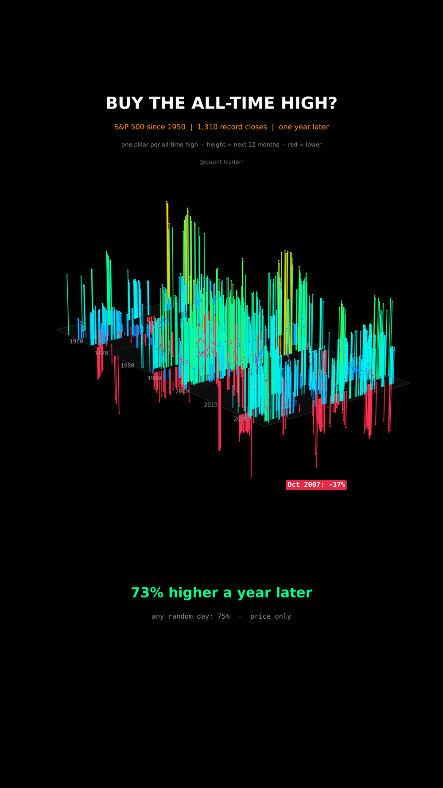

# Buy the All-Time High?

Is a record close a bad day to buy? Every S&P 500 all-time high since 1950,
and where the index stood one year later.



## What it measures

Data: S&P 500 price index (`^GSPC`) daily closes from Yahoo, Dec 1927 to
Sep 2026. A day is an all-time high when its close is above every earlier
close since Dec 1927, so the first new high after the 1929 peak only comes in
1954. For every day from 1950 with a full year ahead:
`r = close[t+252] / close[t] - 1`. The share of all-time-high days with
`r > 0` is compared with the same share over all days.

In 3D: a forest. One pillar per all-time high, x = year, y = trading day
inside that year, height = the return over the next 252 sessions. Gains run
blue to orange, red pillars hang below the floor. Years without a new high
are clearings.

## What came out

| | All-time highs | All days |
|---|---|---|
| Days counted | 1,310 | 19,056 |
| Higher a year later | 73% | 75% |
| Median next 12 months | +10% | +11% |

The worst all-time high, Oct 2007, was -37% one year later.

## What this is not

**Not proof that highs are a buy signal.** They are not better than a random
day, only not worse. Highs cluster in runs, so the 1,310 pillars are far
fewer independent bets than they look. Price index only: no dividends, no
inflation. One index, one country, 75 years that went well.

## Run it

```bash
cd ..
uv venv .venv --python 3.12
uv pip install --python .venv/bin/python -r requirements.txt
cd buy-the-all-time-high

../.venv/bin/python AllTimeHigh_Reel_Pipeline.py --smoke
../.venv/bin/python AllTimeHigh_Reel_Pipeline.py
../.venv/bin/python AllTimeHigh_Static_Pipeline.py
../.venv/bin/python AllTimeHigh_Caption.py
```
