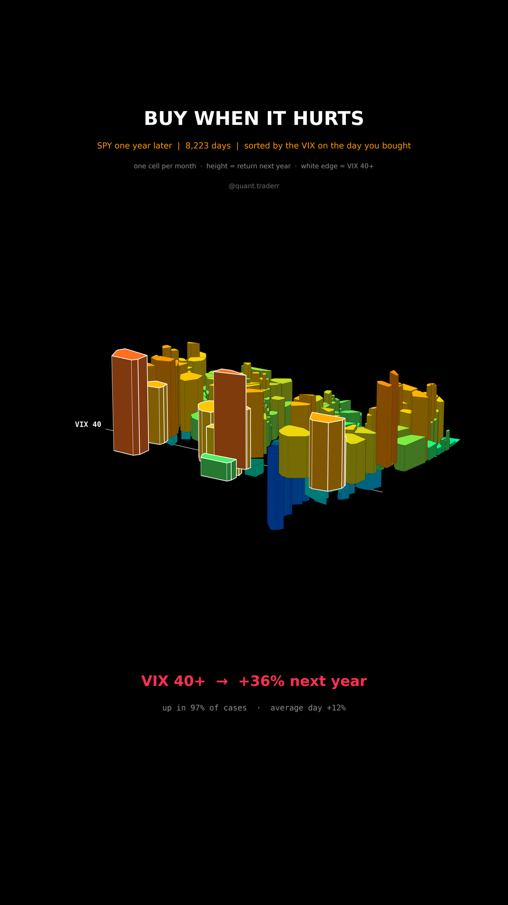

# Buy When It Hurts

Every SPY trading day from 1993 to Sep 2025, sorted by the VIX close on that
day, and what SPY did over the following year.



## What it measures

Data: SPY daily closes (auto-adjusted, dividends reinvested) and the CBOE VIX
close from Yahoo. For every day, the forward return is
`SPY[t+252] / SPY[t] - 1`, the total return over the next 252 sessions. Days
without a full year ahead are dropped. All figures are computed on daily
observations, bucketed by the VIX close on the day of purchase.

In 3D: a Voronoi tessellation of month-ends. Each month-end is a seed at
(time, log VIX), and its cell is extruded to the forward 12-month return, so
cells below the floor lost money. Colour carries the same return. Cells bought
at VIX 40 or above have a white edge; white lines mark VIX 40 and VIX 15.

## What came out

| Figure | Value |
|---|---|
| Days with a full year ahead | 8,223 |
| Average next-year return, all days | +12%, up in 82% |
| Days with VIX close >= 40 | 208, in 10 calendar years |
| Average next-year return, VIX >= 40 | +36%, up in 97% |
| Average next-year return, VIX < 15 | +13% |
| Worst VIX-40 entry | Sep 2001, -16% |
| VIX peak | 83, Mar 2020 |

## What this is not

**Not a timing rule.** The 208 fear days cluster in a handful of crises
(1998, 2001 to 2002, 2008 to 2011, 2015, 2020, 2025), so the sample is a few
episodes, not 208 independent trades, and consecutive days share most of
their forward year. Hindsight only shows crises that ended. Cell areas come
from how month-ends spread over time and VIX and carry no weight in the
numbers. No costs, no taxes.

## Run it

```bash
cd ..
uv venv .venv --python 3.12
uv pip install --python .venv/bin/python -r requirements.txt
cd buy-when-it-hurts

../.venv/bin/python BuyTheFear_Reel_Pipeline.py --smoke
../.venv/bin/python BuyTheFear_Reel_Pipeline.py
../.venv/bin/python BuyTheFear_Static_Pipeline.py
../.venv/bin/python BuyTheFear_Caption.py
```
