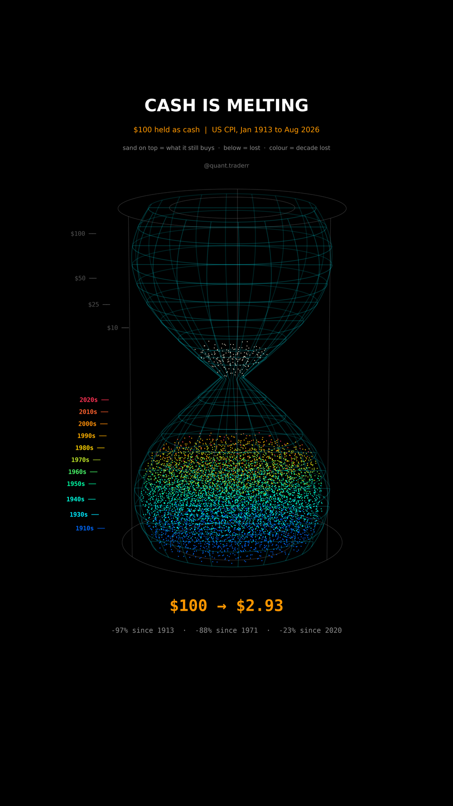

# Cash Is Melting

What $100 of US cash from January 1913 still buys today, run through every
monthly CPI print.



## What it measures

Data: US CPI for all urban consumers, not seasonally adjusted (`CPIAUCNS`),
monthly from FRED, Jan 1913 to Aug 2026. Oct 2025 was never published (US
government shutdown), so that month is skipped, not filled in.

```
value_t = 100 * CPI_Jan1913 / CPI_t
```

In 3D: a glass hourglass. The sand in the top chamber is what the $100 still
buys, the sand in the bottom chamber is the purchasing power lost, coloured by
the decade it was lost in for good.

## What came out

| | |
|---|---|
| $100 from Jan 1913, in Aug 2026 | $2.93 (-97%) |
| average inflation | 3.2% a year |
| value by Aug 1971 (gold window closed) | $24.02 |
| lost since 1971 | 88% |
| lost since Jan 2000 | 50% |
| lost since Jan 2020 | 23% |
| worst 12 months | +23.7%, Jun 1920 |
| 2020s peak | +9.1%, Jun 2022 |
| Depression deflation | $100 bought $77.78 again by Mar 1933 |

## What this is not

**Not the loss a real saver took.** CPI is an average basket that keeps
changing, so this is an index ratio, not the price of one fixed shopping cart.
Nobody holds one banknote for 113 years: interest rates and wages rose along
with prices. T-bills are left out on purpose, Yahoo's `^IRX` only starts
around 1960, which would not be a fair comparison. The point is the quiet
yearly tax on idle cash, not that savers lost 97%.

## Run it

```bash
cd ..
uv venv .venv --python 3.12
uv pip install --python .venv/bin/python -r requirements.txt
cd cash-is-melting

../.venv/bin/python CashMelting_Reel_Pipeline.py --smoke
../.venv/bin/python CashMelting_Reel_Pipeline.py
../.venv/bin/python CashMelting_Static_Pipeline.py
../.venv/bin/python CashMelting_Caption.py
```
