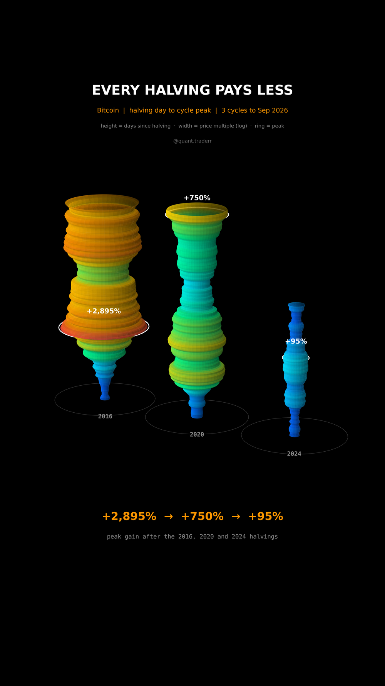

# Every Halving Pays Less

Bitcoin from each halving day to the highest close before the next halving,
three cycles side by side.



## What it measures

Data: BTC-USD daily closes from Yahoo, Sep 2014 to Sep 2026. Halving dates:
9 Jul 2016, 11 May 2020, 19 Apr 2024. The Nov 2012 halving is not included
because the Yahoo series starts in Sep 2014.

For each cycle, `m(t) = close[t] / close[halving]` for every day up to the day
before the next halving; the open 2024 cycle runs to the last close. The peak
is `max m(t)`.

In 3D: one surface of revolution per cycle. Height is days since the halving,
the same scale for all three. Radius is `0.12 + 0.70 * log10(m)`, so a goblet
bulges where the multiple was high. For display only, the multiple is smoothed
with a 15-day centred mean; the white ring marks the exact peak day. All three
grow on one clock, so every frame compares them at the same day after their
halving.

## What came out

| Cycle | Halving close | Peak close | Peak date | Days to peak | Peak gain |
|---|---|---|---|---|---|
| 2016 | $651 | $19,497 | Dec 2017 | 525 | +2,895% |
| 2020 | $8,602 | $73,084 | Mar 2024 | 1,402 | +750% |
| 2024 (open) | $63,844 | $124,753 | Oct 2025 | 535 | +95% |

Last close in the data: $83,554, +31% from the 2024 halving.

## What this is not

**Not a forecast and not a model of the halving.** Three cycles are three
data points, the peaks are picked with hindsight, and the 2024 cycle is still
open, so its peak can still rise. The 2020 peak is the highest close before
the 2024 halving, which landed in Mar 2024, not the Nov 2021 top. The shrinking
multiple also fits a simpler story: a bigger asset needs more money to move by
the same percentage.

## Run it

```bash
cd ..
uv venv .venv --python 3.12
uv pip install --python .venv/bin/python -r requirements.txt
cd every-halving-pays-less

../.venv/bin/python Halving_Reel_Pipeline.py --smoke
../.venv/bin/python Halving_Reel_Pipeline.py
../.venv/bin/python Halving_Static_Pipeline.py
../.venv/bin/python Halving_Caption.py
```
