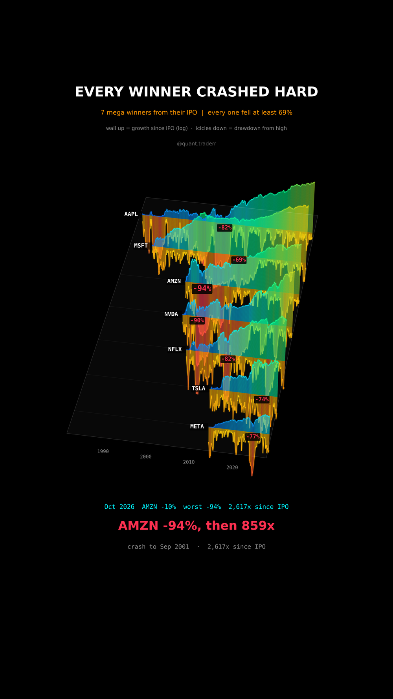

# Every Winner Crashed Hard

Seven of the biggest winners on the US market, each from its first trading
day, and the deepest crash every one of them sat through on the way up.



## What it measures

Data: daily closes from Yahoo (yfinance, `auto_adjust`, so splits and
dividends are folded in) for AAPL, MSFT, AMZN, NVDA, NFLX, TSLA and META,
each from its IPO up to the last closed session before Oct 2026.

```
multiple_t = close_t / close_first           growth since the IPO
drawdown_t = close_t / max(close_<=t) - 1    distance below the running high
```

Per stock: total multiple, deepest drawdown and the month of its trough, and
the multiple from that trough to the last close.

In 3D: a cave. One lane per stock in depth, time along x. Above the floor a
glowing wall rises with log10 of the multiple. Below the floor the drawdown
hangs down as icicles, redder and longer the deeper the crash.

## What came out

| Stock | Since IPO | Deepest drawdown | Trough | From the trough |
|---|---|---|---|---|
| AAPL | 3,400x | -82% | Apr 2003 | 1,700x |
| MSFT | 8,969x | -69% | Mar 2009 | 48x |
| AMZN | 2,617x | -94% | Sep 2001 | 859x |
| NVDA | 6,377x | -90% | Oct 2002 | 4,259x |
| NFLX | 574x | -82% | Sep 2012 | 89x |
| TSLA | 239x | -74% | Jan 2023 | 3.5x |
| META | 20x | -77% | Nov 2022 | 8.4x |

Every one fell at least 69% from a high.

## What this is not

**Not evidence that crashes lead to big winners.** These seven were picked
because they won, after the fact: survivorship bias. Plenty of stocks that
fell 90% never came back, and they are not in this picture. TSLA and META hit
their worst drawdown after most of their gains, not before. Prices only, no
fees, no taxes, not a strategy and not a forecast.

## Run it

```bash
cd ..
uv venv .venv --python 3.12
uv pip install --python .venv/bin/python -r requirements.txt
cd every-winner-crashed-hard

../.venv/bin/python WinnersCrashed_Reel_Pipeline.py --smoke
../.venv/bin/python WinnersCrashed_Reel_Pipeline.py
../.venv/bin/python WinnersCrashed_Static_Pipeline.py
../.venv/bin/python WinnersCrashed_Caption.py
```
