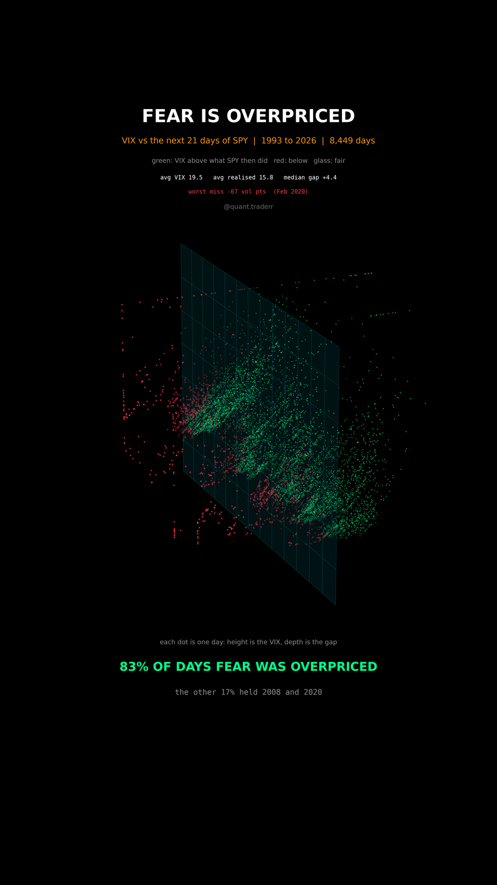

# Fear Is Overpriced

The VIX set against the volatility the S&P actually delivered over the month
that followed, every trading day since 1993.



## What it measures

The VIX is the market's price for the next 30 calendar days of S&P volatility,
annualised, in volatility points. Realised volatility is what then happened:
the standard deviation of SPY's daily log returns over the next 21 trading
days, times `sqrt(252)`, times 100, so both are in the same unit.

The spread **VIX minus realised** is the volatility risk premium: what buyers
of protection paid above what the market went on to deliver.

Each day is one dot in 3D: time along the floor, the spread in depth, the VIX
level up. The glass wall stands at a spread of zero. Dots in front of it
(green) are days the insurance was overpriced, dots behind it (red) are days it
was too cheap.

## What came out

| Figure | Value |
|---|---|
| Days where the VIX was above what followed | 83% |
| Days where it was below | 17% |
| Average VIX | 19.5 |
| Average realised volatility (next 21 days) | 15.8 |
| Median gap | 4.4 vol points |
| Worst miss | -67 vol points, Feb 2020 |
| Lowest share in any decade | 79% |
| Days in the sample | 8,449 |

The validate stage also asserts that the run-ups to the 2008 and 2020 selloffs
were mostly red, which is what the line "the other 17% held 2008 and 2020"
rests on.

## What this is not

**Not a trading strategy.** Selling volatility collects the green days slowly
and gives it back on the red ones in a handful of sessions, and the red days
are the crashes. That asymmetry is exactly why the premium exists and why it
has not been arbitraged away.

The VIX is also not an exact forecast of SPY volatility: it is priced off S&P
500 index options over 30 calendar days, and here it is compared with close to
close SPY volatility over 21 trading days. That is the standard proxy, not an
identity. The display axes are capped (VIX at 55, the gap at 30 points either
way), which moves a few days in 2008 and 2020 to the edge of the picture;
every figure uses the raw values.

## Run it

```bash
cd ..
uv venv .venv --python 3.12
uv pip install --python .venv/bin/python numpy pandas matplotlib yfinance imageio-ffmpeg scipy pillow
cd fear-is-overpriced

../.venv/bin/python VolPremium_Reel_Pipeline.py --smoke
../.venv/bin/python VolPremium_Reel_Pipeline.py
../.venv/bin/python VolPremium_Static_Pipeline.py
../.venv/bin/python VolPremium_Caption.py
```

The first run fetches from Yahoo Finance and caches to `_cache/`. Your figures
will differ from the table above as the data moves on; the asserts are bands
rather than snapshots, so the build still passes. `figures.json` records what
the posted version was built on.
