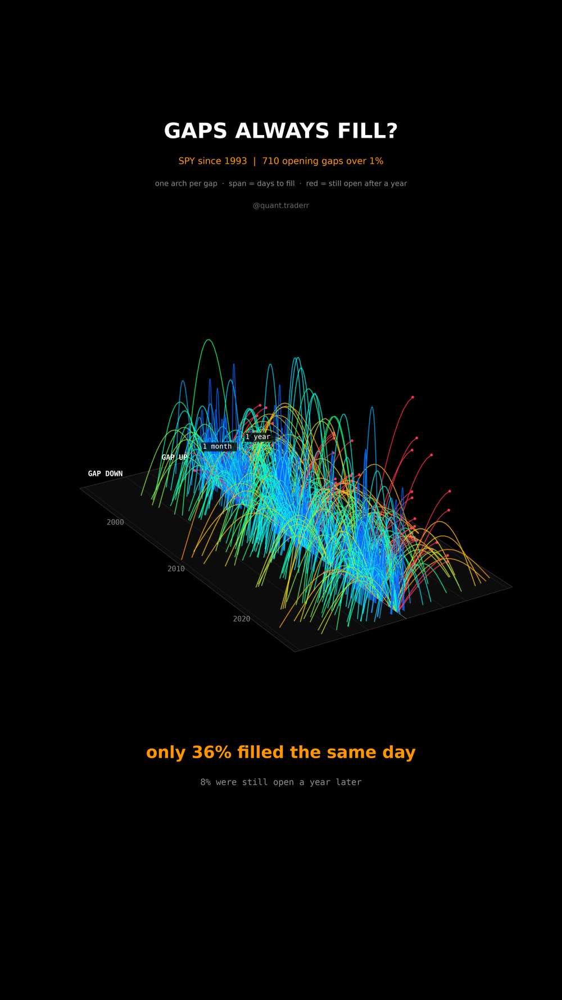

# Gaps Always Fill?

Every opening gap of more than 1% in SPY since 1993, and how long it took
the price to come back to the previous close.



## What it measures

Data: SPY daily open, high, low and close from Yahoo, Jan 1993 to Sep 2026,
dividend-adjusted so ex-dividend days do not show up as fake gaps.
`gap = open[t] / close[t-1] - 1`, counted when `|gap| > 1%`. A gap up is
filled on the first day with `low <= close[t-1]`, a gap down on the first
day with `high >= close[t-1]`. A fill inside the gap day itself counts as
same day. Only gaps with a full 252 sessions ahead are counted.

In 3D: a field of arches. x = date of the gap. Each arch springs from the
centre line and lands at the days it took to fill (log scale), gap ups to
one side, gap downs to the other. Height is the size of the gap. Red half
arches never came down within a year.

## What came out

| Gaps over 1% (710) | Filled |
|---|---|
| same day | 36% |
| within a week | 66% |
| within a month | 81% |
| still open after a year | 8% |

Gap downs filled the same day 41% of the time, gap ups 31%. Counting every
gap, however small, 67% fill the same day. The biggest was -10% in Mar 2020.

## What this is not

**Not a trading rule in either direction.** Small gaps do fill most of the
time, which is where the saying comes from. "Filled" ignores the path: a gap
that fills after a deep drawdown counts the same as one that fills by lunch.
One ETF, daily bars, no intraday data.

## Run it

```bash
cd ..
uv venv .venv --python 3.12
uv pip install --python .venv/bin/python -r requirements.txt
cd gaps-always-fill

../.venv/bin/python Gaps_Reel_Pipeline.py --smoke
../.venv/bin/python Gaps_Reel_Pipeline.py
../.venv/bin/python Gaps_Static_Pipeline.py
../.venv/bin/python Gaps_Caption.py
```
