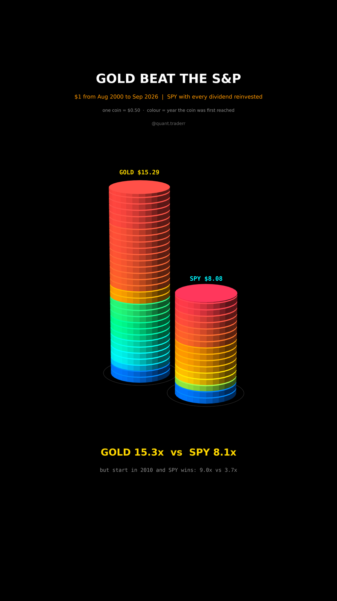

# Gold Beat the S&P

One dollar in gold and one dollar in SPY with every dividend reinvested, from
Aug 2000 to Sep 2026, stacked as coins.



## What it measures

Data: Yahoo `GC=F` (front-month COMEX gold future) as a gold price proxy; it
starts on 30 Aug 2000, so that is day one. Yahoo `SPY`, auto-adjusted, so
dividends are reinvested. Both on the days both traded.
`value[t] = close[t] / close[start]`, the worth of $1. The same ratio is also
computed from the first trading day of 2010.

In 3D: two stacks of coins, one coin = $0.50 of value. The build walks
month-end by month-end, so stacks shrink in a crash and grow back. A coin's
colour is the year its level was first reached (blue = 2000s, red = 2020s):
the colour says when the wealth arrived.

## What came out

| Figure | Gold | SPY |
|---|---|---|
| $1 from Aug 2000 | $15.29 (15.3x) | $8.08 (8.1x) |
| From Jan 2010 | 3.7x | 9.0x |
| Max drawdown | -44%, Aug 2011 to Dec 2015, back Jul 2020 | -55%, low Mar 2009, back Aug 2012 |

## What this is not

**Not proof that gold is the better asset.** The result hangs on the start
date: Aug 2000 was the top of the dot-com bubble and the end of a long slump
in gold. Start in 2010 and SPY wins by a wide margin. Gold pays no income.
Futures prices skip storage, ETF fees and roll costs; no taxes, no inflation
adjustment.

## Run it

```bash
cd ..
uv venv .venv --python 3.12
uv pip install --python .venv/bin/python -r requirements.txt
cd gold-beat-the-sp

../.venv/bin/python GoldCoins_Reel_Pipeline.py --smoke
../.venv/bin/python GoldCoins_Reel_Pipeline.py
../.venv/bin/python GoldCoins_Static_Pipeline.py
../.venv/bin/python GoldCoins_Caption.py
```
