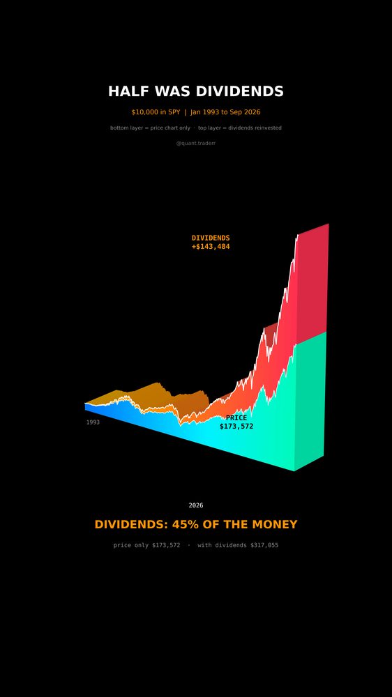

# Half Was Dividends

$10,000 in SPY from Jan 1993 to Sep 2026, counted two ways: the price chart
everybody looks at, and the same holding with every dividend reinvested.



## What it measures

```
price_t = 10,000 * Close_t    / Close_0       (traded price, SPY never split)
total_t = 10,000 * AdjClose_t / AdjClose_0    (dividends folded back in)
dividend share = (total - price) / total
```

`validate()` also checks that the total never falls below the price, which
would mean a broken series.

In 3D: a sediment block. Time along the long axis, dollar value on a linear
scale. The bottom stratum, blue to cyan, is the price-only value. The top
stratum, orange to red, is what reinvested dividends added. The end face shows
both layers in section.

## What came out

| Figure | Value |
|---|---|
| Price chart only | $173,572 (17.4x) |
| Dividends reinvested | $317,055 (31.7x) |
| Difference | $143,484 |
| Share of the end value from dividends | 45% |

## What this is not

Not a claim that dividend stocks beat other stocks: it is one index counted
with and without its own payouts. No taxes; a taxable account pays tax on the
dividends every year. The dividend layer includes the growth on reinvested
dividends, not only the cash paid out. Linear height makes the early years look
flat; the readout numbers are exact.

## Run it

```bash
cd ..
uv venv .venv --python 3.12
uv pip install --python .venv/bin/python -r requirements.txt
cd half-was-dividends

../.venv/bin/python Dividends_Reel_Pipeline.py --smoke
../.venv/bin/python Dividends_Reel_Pipeline.py
../.venv/bin/python Dividends_Static_Pipeline.py
../.venv/bin/python Dividends_Caption.py
```
