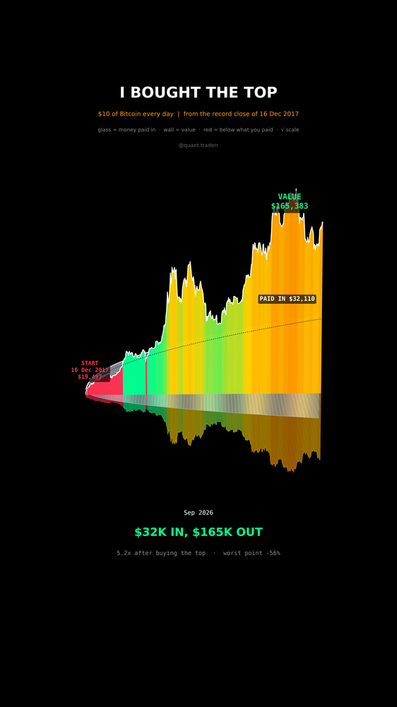

# I Bought the Top

$10 of Bitcoin every single day, starting on the worst possible day: the
record close of 16 Dec 2017.



## What it measures

```
start      = highest close of 2017 (and of 2021, for comparison)
coins_t    = sum(10 / price_s)        one buy per daily close
value_t    = coins_t * price_t
deposits_t = 10 * days so far
underwater = value below deposits
```

`validate()` checks that each start really is a record close, nothing earlier
in the data closed higher.

In 3D: a mirrored area graph. The front wall is the plan's value, green above
what was paid in and red below it. Behind it stands a pale glass wall, the
deposits. The floor reflects both. Heights are the square root of dollars, so
2018 to 2020, when the sums were small, stays visible; the labels are exact.

## What came out

| Figure | Value |
|---|---|
| Start, 16 Dec 2017 | $19,497 |
| Paid in / worth (Sep 2026) | $32,110 / $165,383 (5.2x) |
| Worst point vs deposits | -56% |
| Days underwater | 16%, last in Apr 2020 |
| Next top, 8 Nov 2021 at $67,567 | $17,880 in, $35,157 out (2.0x) |

## What this is not

Hindsight on the one coin that survived. Thousands of coins also had a record
close and then went to zero, and a daily plan into one of those ends at zero.
Past cycles promise nothing. No fees, no taxes, no spread.

## Run it

```bash
cd ..
uv venv .venv --python 3.12
uv pip install --python .venv/bin/python -r requirements.txt
cd i-bought-the-top

../.venv/bin/python EvenAtTop_Reel_Pipeline.py --smoke
../.venv/bin/python EvenAtTop_Reel_Pipeline.py
../.venv/bin/python EvenAtTop_Static_Pipeline.py
../.venv/bin/python EvenAtTop_Caption.py
```
