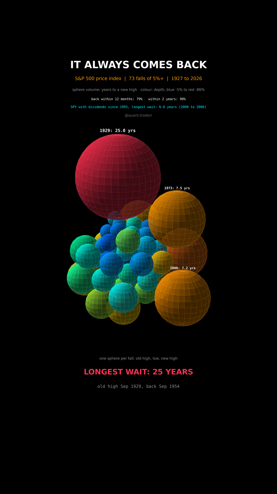

# It Always Comes Back

Every fall of 5% or more in the S&P 500 since 1927, from old high to low to
new high, and how long the wait was.



## What it measures

An episode starts at a closing high, runs through its lowest close and ends on
the first close at or above that old high. Episodes at least 5% deep are kept.
The wait is the calendar time from the old high to the new one. An episode
still open on the last day of the data is not counted, and asserted to be
shallower than 5%, so nothing is hidden.

The main series is `^GSPC`, the price index without dividends. Before 1957 it
held only 90 stocks. SPY with dividends reinvested runs alongside from 1993 as
a check.

In 3D: one sphere per episode. Sphere **volume** is the wait, so the radius is
the cube root of the years. Colour is the depth, blue at -5% to red at the
deepest. The spheres are packed shortest wait first, and the build grows the
pack in that order, the last one being 1929.

## What came out

| Figure | Value |
|---|---|
| Falls of 5% or more since 1927 | 73 |
| Back at the old high within 12 months | 79% |
| Back within 2 years | 90% |
| Median wait | 2.8 months |
| Longest wait | 25 years, Sep 1929 to Sep 1954, depth -86% |
| 1973 | 7.5 years |
| 2000 (price index) | 7.2 years |
| 2000 (SPY with dividends) | 6.6 years |

## What this is not

**Not a total-return picture.** With dividends reinvested every wait is
shorter, and nothing here is adjusted for inflation, which would make the
1970s wait longer.

Positions inside the pack carry no meaning beyond the order of the waits.
One index over one century is one history, not a law. And it says nothing
about single stocks, many of which never came back at all.

## Run it

```bash
cd ..
uv venv .venv --python 3.12
uv pip install --python .venv/bin/python numpy pandas matplotlib yfinance imageio-ffmpeg scipy pillow
cd it-always-comes-back

../.venv/bin/python Recovery_Reel_Pipeline.py --smoke
../.venv/bin/python Recovery_Reel_Pipeline.py
../.venv/bin/python Recovery_Static_Pipeline.py
../.venv/bin/python Recovery_Caption.py
```

The first run fetches from Yahoo Finance and caches to `_cache/`. Your figures
will differ from the table above as the data moves on; the asserts are bands
rather than snapshots, so the build still passes. `figures.json` records what
the posted version was built on.
