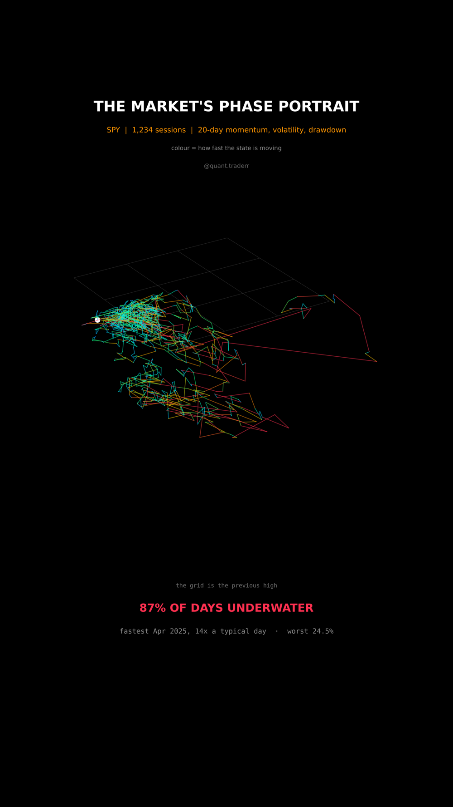

# The Market's Phase Portrait

Five years of SPY drawn as a single path through a three dimensional state
space, with a head that races along it at roughly 145 sessions per second.



## What it measures

Three features describe SPY on any session:

- 20 day momentum, `px / px.shift(20) - 1`
- 20 day realised volatility, the standard deviation of log returns times the
  square root of 252
- drawdown from the running high, `px / px.cummax() - 1`

Each feature is standardised to zero mean and unit variance. That step is not
cosmetic: momentum in percent, annualised volatility in percent and drawdown in
percent are three different rulers, and without standardising, the "distance"
the speed measures would be dominated by whichever feature happens to have the
widest raw spread.

State speed is the length of the step from one session to the next in that
standardised space, and it drives the colour. The faint grid marks the level
where drawdown is zero, so the plane is the previous high and the path hangs
below it.

## What came out

| Figure | Value |
|---|---|
| Share of sessions below the previous high | 87% |
| Deepest drawdown | 24.5% |
| Volatility range along the path | 5% to 54% |
| Fastest single session, relative to a typical one | 14x, Apr 2025 |
| Sessions | 1,234 |

The market does not move through its own states at a constant rate. It crawls
for months and then covers more ground in a day than it usually does in a
fortnight.

## What this is not

Not a forecast: nothing here says where the path goes next. Not the market
either, because three features are a choice out of many and a different three
would draw a different shape. **A loop in a phase portrait is not a cycle you
can trade.** The windows overlap, so consecutive states are not independent, and
the standardisation is over this sample only.

## Run it

```bash
cd ..
python3 -m venv .venv
.venv/bin/pip install -r requirements.txt
cd phase-portrait

../.venv/bin/python PhasePortrait_Reel_Pipeline.py --smoke
../.venv/bin/python PhasePortrait_Reel_Pipeline.py
../.venv/bin/python PhasePortrait_Static_Pipeline.py
../.venv/bin/python PhasePortrait_Caption.py
```

The first run fetches from Yahoo Finance and caches to `_cache/`. Your figures
will differ from the table above as the data moves on; the asserts are bands
rather than snapshots, so the build still passes. `figures.json` records what the
posted version was built on.
