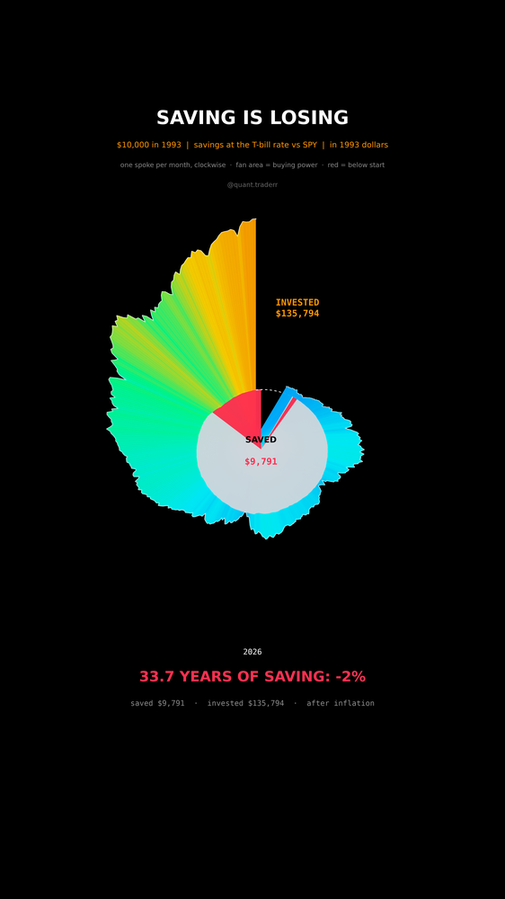

# Saving Is Losing

$10,000 put aside in Jan 1993, once in cash earning the 13-week T-bill rate,
once in SPY with dividends reinvested, both measured in 1993 dollars, so by
what the money can still buy. To Sep 2026.



## What it measures

```
cash_t     = 10,000 * prod(1 + IRX_{s-1} / 100 / 252)
invested_t = 10,000 * SPY_t / SPY_0
real_x_t   = x_t * CPI_0 / CPI_t        (CPIAUCNS from FRED, last print Aug 2026)
```

Both pots are deflated by the same CPI, so the gap between them is not an
artefact of the deflator.

In 3D: a nautilus. One spoke per month, clockwise, from two o'clock round to
twelve. Spoke length is the square root of the real value, so the area of each
fan grows with the money. The colour fan behind is INVESTED. The pale fan in
front is SAVED, red wherever it buys less than at the start. The dashed ring is
the starting $10,000.

## What came out

| Figure | Value |
|---|---|
| Savings, nominal | $23,000 |
| Savings, in 1993 dollars | $9,791 (-2%) |
| SPY, nominal | $318,993 |
| SPY, in 1993 dollars | $135,794 |
| Price level | x2.35 |
| Share of days the savings sat below their starting buying power | 17% |

## What this is not

Not a real savings account: T-bills paid more than most bank accounts, so a
typical saver did worse than this line. No taxes in either pot. Not a claim
that cash is useless: it never crashed with the market, which is what an
emergency fund is for. One country, one index, one stretch of history.

## Run it

```bash
cd ..
uv venv .venv --python 3.12
uv pip install --python .venv/bin/python -r requirements.txt
cd saving-is-losing

../.venv/bin/python SavingLoses_Reel_Pipeline.py --smoke
../.venv/bin/python SavingLoses_Reel_Pipeline.py
../.venv/bin/python SavingLoses_Static_Pipeline.py
../.venv/bin/python SavingLoses_Caption.py
```
