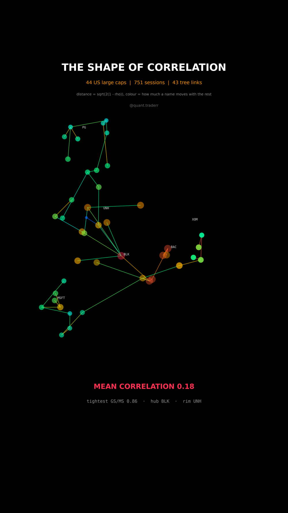

# The Shape of Correlation

44 US large caps placed in a metric space built from their return correlations,
wired by the minimum spanning tree.



## What it measures

Three years of daily log returns. Every pair gets a Pearson correlation, which
becomes the Mantegna distance

```
d_ij = sqrt(2 * (1 - rho_ij))
```

That is a proper metric, unlike `1 - rho`. Classical multidimensional scaling
places every name in 3D: double centre the squared distance matrix, take the top
three eigenvectors and scale each by the square root of its eigenvalue.

The edges are the minimum spanning tree of the full distance matrix, so exactly
n - 1 links: the cheapest wiring that still reaches every name. Node colour is
each name's average correlation to all the others, so hot means central in the
same sense the position does.

**No sector label enters the maths at any point.** The clustering of technology,
banking, energy and defensive names is something the distances produce, not
something that was put in.

One detail that is load bearing: all three axes share one scale, enforced by
setting `box_aspect` to the same proportions as the limits. In a picture whose
whole subject is distance, letting matplotlib stretch the weaker directions to
fill the box would make two names look closer or further apart than the maths
says.

## What came out

| Figure | Value |
|---|---|
| Average pairwise correlation | 0.18 |
| Tightest pair | GS / MS at 0.86 |
| Most central name | BLK |
| Most peripheral name | UNH |
| Sessions, tree links | 751, 43 |

## What this is not

Not causation. Not a forecast. Not a sector map. **Not a faithful picture of the
distance matrix either:** three dimensions hold only 35% of its structure, and
that share is asserted and shown on screen rather than hidden. Distances between
two points that share no tree edge are approximations, not measurements.

## Run it

```bash
cd ..
python3 -m venv .venv
.venv/bin/pip install -r requirements.txt
cd shape-of-correlation

../.venv/bin/python CorrelationSpace_Reel_Pipeline.py --smoke
../.venv/bin/python CorrelationSpace_Reel_Pipeline.py
../.venv/bin/python CorrelationSpace_Static_Pipeline.py
../.venv/bin/python CorrelationSpace_Caption.py
```

The first run fetches from Yahoo Finance and caches to `_cache/`. Your figures
will differ from the table above as the data moves on; the asserts are bands
rather than snapshots, so the build still passes. `figures.json` records what the
posted version was built on.
