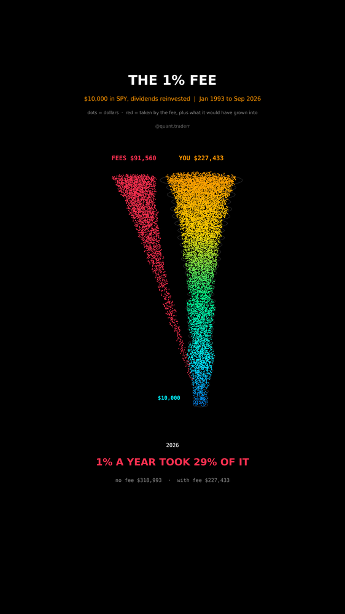

# The 1% Fee

$10,000 in SPY with dividends reinvested, Jan 1993 to Sep 2026, once as is and
once with a 1% annual fee taken out, the kind an advisor or an active fund
charges. Every dollar the fee removes, plus everything it would have grown
into, is peeled off as a red stream.



## What it measures

```
no_fee_t  = 10,000 * SPY_t / SPY_0
fee_t     = no_fee_t * (1 - f)^years_t
drained_t = no_fee_t - fee_t
```

The share lost, `1 - (1 - f)^years`, depends only on time and not on the path,
which `validate()` checks against the end values. The fee is a hypothetical
overlay on the real SPY path, not a real product's history.

In 3D: particle streams rising like a trunk, time on the vertical axis. Each
time slice holds dots in proportion to the no-fee balance. The share the fee
has claimed by then is red and flows into a branch that splits off, FEES. A dim
ring traces how wide YOU would be without the fee.

## What came out

| Figure | Value |
|---|---|
| No fee | $318,993 |
| With a 1% yearly fee | $227,433 |
| Taken by the fee, including lost growth | $91,560 (29%) |
| Same for a 0.5% fee | 16% |
| Same for a 2% fee | 49% |
| Years | 33.7 |

## What this is not

Not a claim that every fee is wasted: a manager who beats the index by more
than the fee earns it. Most do not, and this reel does not test that. SPY's
own 0.09% expense ratio is already inside the no-fee line. No taxes, no
inflation. Dot positions inside a stream are random scatter for texture; only
the dot count per slice and the red share carry data.

## Run it

```bash
cd ..
uv venv .venv --python 3.12
uv pip install --python .venv/bin/python -r requirements.txt
cd the-1-percent-fee

../.venv/bin/python FeeDrain_Reel_Pipeline.py --smoke
../.venv/bin/python FeeDrain_Reel_Pipeline.py
../.venv/bin/python FeeDrain_Static_Pipeline.py
../.venv/bin/python FeeDrain_Caption.py
```
