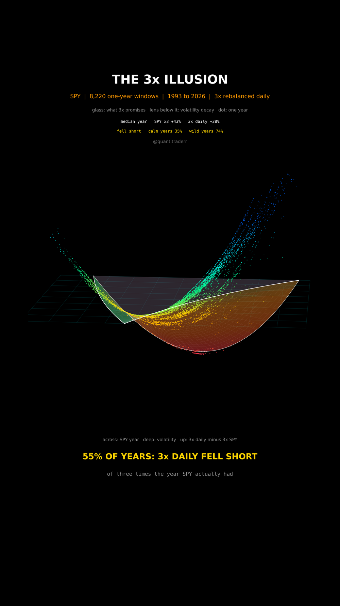

# The 3x Illusion

Every one-year window of SPY since 1993: a daily 3x product rebuilt from real
SPY returns, held against three times the year SPY actually had.



## What it measures

`r_t` is the daily return of SPY from adjusted closes. For each start day and
the next 252 trading days:

```
SPY year      R  = prod(1 + r_t) - 1
3x promised   3R
3x daily      L  = prod(1 + 3 r_t) - 1
gap           L - 3R, in percentage points
```

The glass lens is the continuous-time approximation of the same gap,
`(1 + R)^3 * exp(-3 sigma^2) - 1 - 3R`. Its flat face is "exactly what 3x
promises", its curved face hangs below wherever volatility eats more than
compounding adds: that pocket is **volatility decay**. The formula only draws
the glass. Every number comes from the daily data, and `validate()` asserts
that data and formula agree before a frame is drawn.

In 3D: SPY's one-year return runs across, realized volatility into depth, the
gap goes up. Every dot is one window, coloured by its gap.

## What came out

| Figure | Value |
|---|---|
| One-year windows | 8,220 |
| 3x daily fell short of 3x the year | 55% |
| In the calmer half of years (vol under about 15%) | 35% |
| In the wilder half | 74% |
| SPY rose, 3x daily still lost money | 5% |
| Median promise (SPY x3) | +43% |
| Median delivered (3x daily) | +38% |
| Worst gap | -60 points, window starting 2008 |

## What this is not

**Not a backtest of any fund you can buy.** No management fee, no financing
cost, no tracking error. Real 3x funds carry those on top, so they would do
worse than this, not better.

Not an argument that 3x never pays: in calm trending years compounding beats
the promise, and the dots above the glass are exactly those years. The windows
overlap heavily, so this is about 33 years of one index, not 8,220
independent trials. The glass is a model drawn for orientation; the counts are
not read from it.

## Run it

```bash
cd ..
uv venv .venv --python 3.12
uv pip install --python .venv/bin/python numpy pandas matplotlib yfinance imageio-ffmpeg scipy pillow
cd the-3x-illusion

../.venv/bin/python LeverageDecay_Reel_Pipeline.py --smoke
../.venv/bin/python LeverageDecay_Reel_Pipeline.py
../.venv/bin/python LeverageDecay_Static_Pipeline.py
../.venv/bin/python LeverageDecay_Caption.py
```

The first run fetches from Yahoo Finance and caches to `_cache/`. Your figures
will differ from the table above as the data moves on; the asserts are bands
rather than snapshots, so the build still passes. `figures.json` records what
the posted version was built on.
