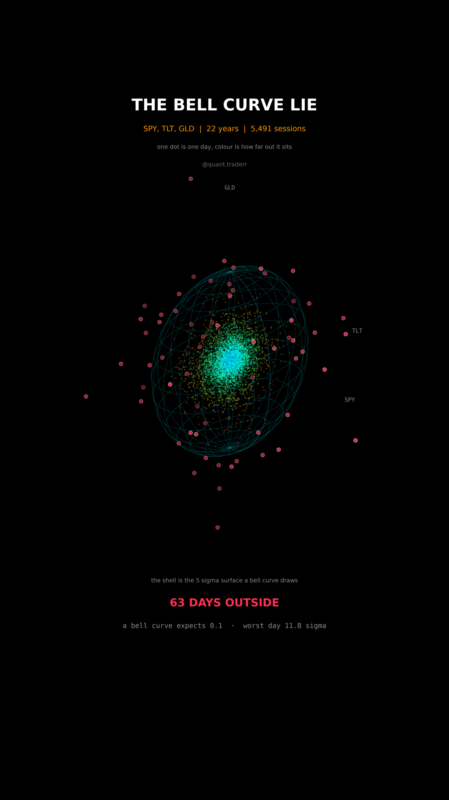

# The Bell Curve Lie

Twenty two years of SPY, TLT and GLD as one cloud of daily returns, with the
shell a fitted normal distribution says almost nothing should cross.



## What it measures

One point per session: that day's log return in each of the three assets,
standardised over the whole sample, so one unit is one standard deviation of
that asset and the three axes are comparable.

Then fit the model that sits inside ordinary risk numbers, a multivariate
normal with one fixed covariance matrix `S`, and measure each day by its
Mahalanobis distance

```
d = sqrt(x' inv(S) x)
```

which is how far out a day sits once the correlations between the three assets
are accounted for. Under that normal distribution `d**2` follows a chi squared
distribution with three degrees of freedom, so the expected number of days
beyond any shell is exact arithmetic, not a simulation.

The shell drawn is the surface `d = 5`. It is the image of the unit sphere
under the Cholesky factor of `S`, scaled by five, which is why it comes out
tilted: the tilt is the correlation structure.

One detail that is load bearing: the odds for the worst day are computed from
`chi2.logsf`, not `chi2.sf`. At 11.8 sigma the survival probability underflows
to zero in double precision, and a naive version reports the odds as infinity
instead of failing.

## What came out

| Figure | Value |
|---|---|
| Sessions, years | 5,491, 22 |
| Days outside the 5 sigma shell | 63 |
| Days a normal distribution expects there | 0.1 |
| Worst day | 11.8 sigma, Oct 2008 |
| Odds of that day under the fitted normal | about 1 in 10^27 years |

## What this is not

Not a claim that returns have no distribution, only that this one does not fit.
**The normal distribution here is a straw man on purpose**, because it is the
assumption buried in everyday risk numbers. Volatility clusters, and a model
that lets the covariance move over time explains much of this excess without
anything exotic.

The covariance is estimated in sample, on the very days it is then tested
against, which flatters the fit rather than the tails. Three assets are not a
market. The odds quoted for the worst day are what the fitted model implies,
not a probability of anything physical, and they are there to show how badly
the model breaks rather than to predict.

## Run it

```bash
cd ..
uv venv .venv --python 3.12
uv pip install --python .venv/bin/python numpy pandas matplotlib yfinance imageio-ffmpeg scipy pillow
cd the-bell-curve-lie

../.venv/bin/python BellCurve_Reel_Pipeline.py --smoke
../.venv/bin/python BellCurve_Reel_Pipeline.py
../.venv/bin/python BellCurve_Static_Pipeline.py
../.venv/bin/python BellCurve_Caption.py
```

The first run fetches from Yahoo Finance and caches to `_cache/`. Your figures
will differ from the table above as the data moves on; the asserts are bands
rather than snapshots, so the build still passes. `figures.json` records what
the posted version was built on.
