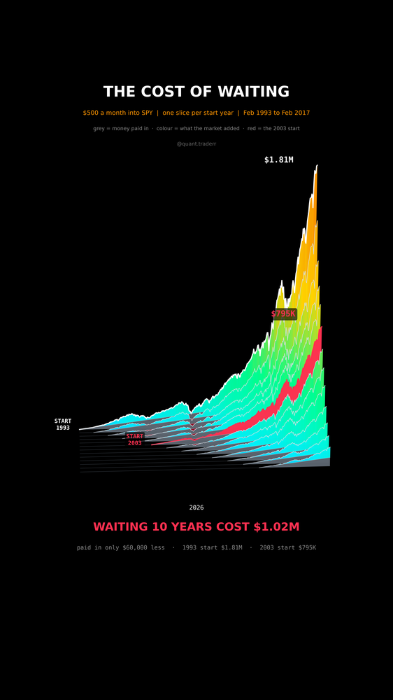

# The Cost of Waiting

The same $500 a month into SPY, started in different years. Waiting looks
cheap on the deposit slip and costs a fortune at the end.



## What it measures

```
for each start year Y (Feb 1993, 1995, ... 2017):
    buy $500 of SPY on the first trading day of every month from Feb Y
    shares_t   = sum(500 / price_buy)
    value_t    = shares_t * price_t        (month-end close, last = last close)
    deposits_t = 500 * buys so far
```

SPY closes are auto-adjusted, so dividends are reinvested. `validate()` also
checks that every later start ends lower than every earlier one.

In 3D: a waterfall of thirteen area graphs, one slice per start year, the
earliest at the back. Each slice is cut in two: a grey base for the money paid
in and a coloured cap for what the market added. The 2003 slice is red.

## What came out

| Figure | Value |
|---|---|
| Start Feb 1993: paid in / worth | $202,000 / $1,810,343 (9.0x) |
| Start Feb 2003: paid in / worth | $142,000 / $794,841 (5.6x) |
| Deposits saved by waiting 10 years | $60,000 |
| Ending value lost by waiting | $1,015,502 |

## What this is not

Not a forecast: 1993 to 2026 was a strong stretch for US stocks, and another
window gives other numbers. No taxes, no fees, no inflation adjustment, and
$500 in 1993 was a bigger share of a paycheck than in 2003.

## Run it

```bash
cd ..
uv venv .venv --python 3.12
uv pip install --python .venv/bin/python -r requirements.txt
cd the-cost-of-waiting

../.venv/bin/python TenYearWait_Reel_Pipeline.py --smoke
../.venv/bin/python TenYearWait_Reel_Pipeline.py
../.venv/bin/python TenYearWait_Static_Pipeline.py
../.venv/bin/python TenYearWait_Caption.py
```
