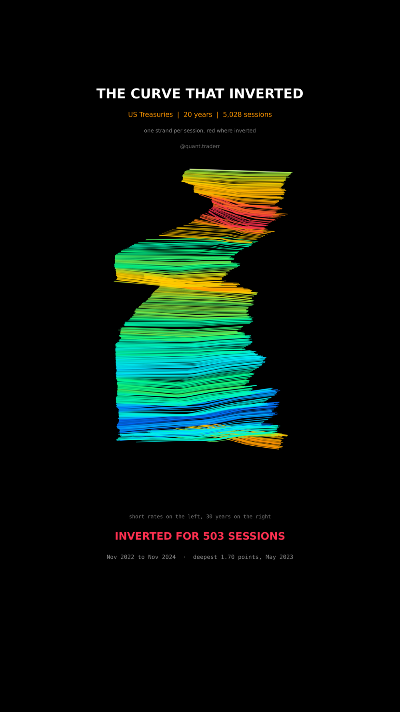

# The Curve That Inverted

Twenty years of the US Treasury curve as a ribbon of strands climbing through
time, twisting where the curve inverts.



## What it measures

Four quoted maturities from Yahoo Finance: 13 weeks (`^IRX`), 5 years (`^FVX`),
10 years (`^TNX`) and 30 years (`^TYX`). One strand per session, running from
short to long along the maturity axis, at its own height on the time axis.

The maturity axis is spaced by the **logarithm** of years, because the step from
3 months to 5 years is not the same kind of step as 10 years to 30. Between the
four quoted points the strand is linearly interpolated, purely so the ribbon
reads as a surface.

Colour is the 10 year yield minus the 13 week yield, the spread the phrase
"inverted curve" refers to, mapped so that **inversion is the hot end**. Sending
inversion to the cold end would be just as defensible and would hide the thing
the reel is about. A session counts as inverted when that spread is below zero.

## What came out

| Figure | Value |
|---|---|
| Longest unbroken inversion | 503 sessions |
| That run | Nov 2022 to Nov 2024 |
| Deepest inversion | 1.70 points, May 2023 |
| Share of all sessions inverted | 15% |
| Sessions | 5,028 |

An inversion is not a moment, it is a season.

## What this is not

**Not a timing signal**, and this reel deliberately shows no market return next
to the curve. Twenty years hold a handful of inversion episodes, which is far too
few to conclude anything about what follows one. Showing a price line beside the
ribbon would invite exactly the inference the sample cannot support.

Four quoted maturities are not the curve; the strand between them is drawn, not
measured. These are index quotes rather than a fitted par curve, and nothing here
forecasts rates.

## Run it

```bash
cd ..
python3 -m venv .venv
.venv/bin/pip install -r requirements.txt
cd the-curve-that-inverted

../.venv/bin/python YieldRibbon_Reel_Pipeline.py --smoke
../.venv/bin/python YieldRibbon_Reel_Pipeline.py
../.venv/bin/python YieldRibbon_Static_Pipeline.py
../.venv/bin/python YieldRibbon_Caption.py
```

The first run fetches from Yahoo Finance and caches to `_cache/`. Your figures
will differ from the table above as the data moves on; the asserts are bands
rather than snapshots, so the build still passes. `figures.json` records what the
posted version was built on.
