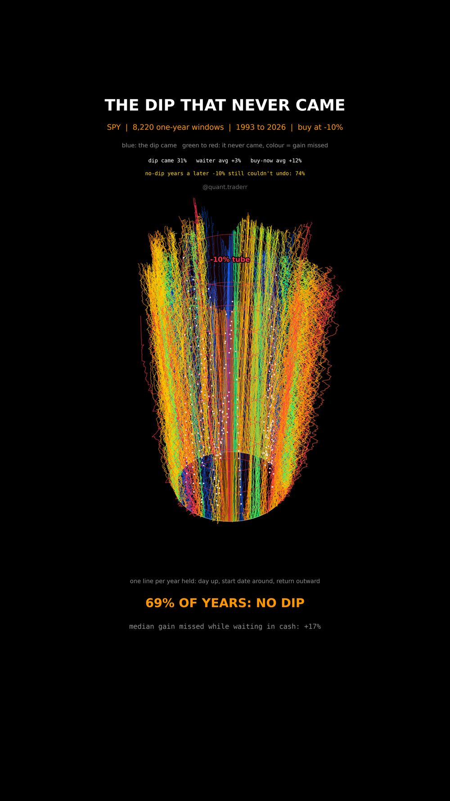

# The Dip That Never Came

Every one-year window of SPY since 1993, started on every trading day, run
against the plan "I'll buy when it drops 10%".



## What it measures

For each start day `s`, the path is `price(s + k) / price(s) - 1` for
`k = 0 .. 252` trading days, on adjusted closes so dividends are in. The dip
**came** if the path reached -10% at any point inside the year. The waiter
holds cash at zero return until the first touch of -10%, buys there and holds
to day 252. No dip, no trade.

In 3D the geometry is cylindrical: height is the trading day, the start date
runs around the circle, and the return is the distance from the axis. Every
path starts on the white entry ring. The red tube is the -10% level. A path
that pierces the tube got its dip, and a white dot marks the fill. A path that
stays outside for the whole year is a year the dip never came, coloured by the
gain it made.

## What came out

| Figure | Value |
|---|---|
| One-year windows | 8,220 |
| Windows where the dip never came | 69% |
| Median SPY year in those windows | +17% |
| No-dip years a later -10% drop could not undo (ended above +11%) | 74% |
| Median wait when the dip did come | 72 trading days |
| Average year, waiting for the dip | +3% |
| Average year, buying on day one | +12% |
| Windows where the waiter came out ahead | 34% |

## What this is not

**Not a case against ever holding cash.** In the crash years, 2008 above all,
waiting was the right call.

The windows overlap heavily, so these are not 8,220 independent trials, this
is about 33 years of one index over a stretch that mostly went up. The
waiter's cash earns zero here; T-bills paid real money in parts of this
history and would narrow the gap. The radius is clipped at -45% and +60% for
display only, and only every 10th window is drawn; every figure uses all of
them, unclipped.

## Run it

```bash
cd ..
uv venv .venv --python 3.12
uv pip install --python .venv/bin/python numpy pandas matplotlib yfinance imageio-ffmpeg scipy pillow
cd the-dip-that-never-came

../.venv/bin/python DipWait_Reel_Pipeline.py --smoke
../.venv/bin/python DipWait_Reel_Pipeline.py
../.venv/bin/python DipWait_Static_Pipeline.py
../.venv/bin/python DipWait_Caption.py
```

The first run fetches from Yahoo Finance and caches to `_cache/`. Your figures
will differ from the table above as the data moves on; the asserts are bands
rather than snapshots, so the build still passes. `figures.json` records what
the posted version was built on.
