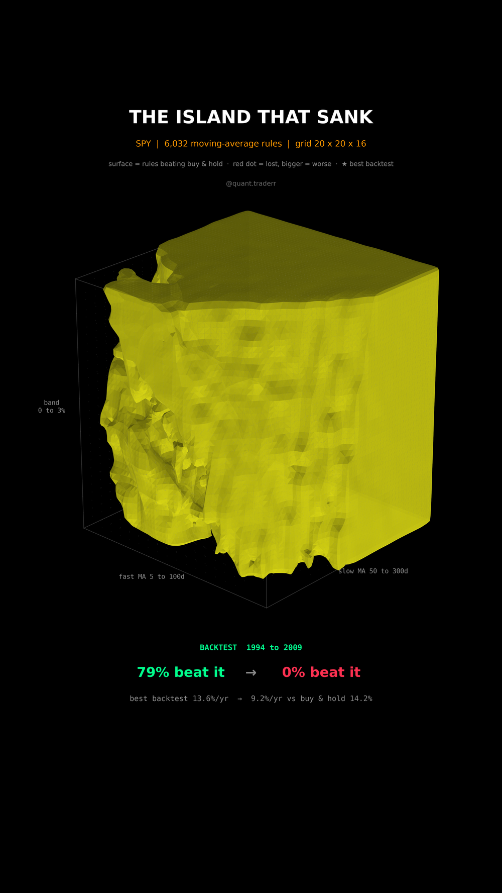

# The Island That Sank

One classic trend rule, 6,032 settings of it, scored on SPY twice: on 1994 to
2009, and on 2010 to 2026.



## What it measures

Rule: long SPY while the fast moving average is above the slow one by more than
a band, in T-bills (`^IRX`) while it is below by more than the band, otherwise
keep the last position. The signal is lagged one day. No costs, no taxes.

Grid: 20 fast windows (5 to 100 days), 20 slow windows (50 to 300 days), 16
bands (0% to 3%). Pairs with fast >= slow are dropped, leaving 6,032 settings.
Score: CAGR of the rule minus CAGR of buy-and-hold over the same days.

In 3D: the grid is a box, fast x slow x band. Part one draws the isosurface of
the in-sample score while its level drops to zero, so the island of settings
that beat buy-and-hold rises out of the box. Part two keeps that island as a
ghost and draws the same zero-surface for a test window that starts Jan 2010
and grows one month at a time, so what sinks is measured, not morphed. At the
end every setting is a red dot, sized by how far it trailed buy-and-hold.

## What came out

| Figure | Value |
|---|---|
| Settings | 6,032 (grid 20 x 20 x 16) |
| Beat buy and hold, 1994 to 2009 | 79% |
| Beat buy and hold, 2010 to 2026 | 0 of 6,032 |
| Tied, because they never sold after 2010 | 12 |
| Best backtest | 33/226-day MA, 0.4% band |
| Its CAGR, 1994 to 2009 | 13.6% vs 7.8% buy and hold |
| Its CAGR, 2010 to 2026 | 9.2% vs 14.2% buy and hold |

## What this is not

**Not proof that trend following is useless.** 2010 to 2026 was a long bull
market with short crashes, the worst case for a slow trend filter, and the rule
still cut drawdowns, which a CAGR score does not reward. Not a risk-adjusted
comparison.

One asset, one rule family, one split date: a different split moves the
numbers. No trading costs, which would only make the rule look worse. The
smooth surface is interpolated between grid points for display; every share in
the table is counted on the raw grid.

## Run it

```bash
cd ..
uv venv .venv --python 3.12
uv pip install --python .venv/bin/python -r requirements.txt
cd the-island-that-sank

../.venv/bin/python BacktestIsland_Reel_Pipeline.py --smoke
../.venv/bin/python BacktestIsland_Reel_Pipeline.py
../.venv/bin/python BacktestIsland_Static_Pipeline.py
../.venv/bin/python BacktestIsland_Caption.py
```
