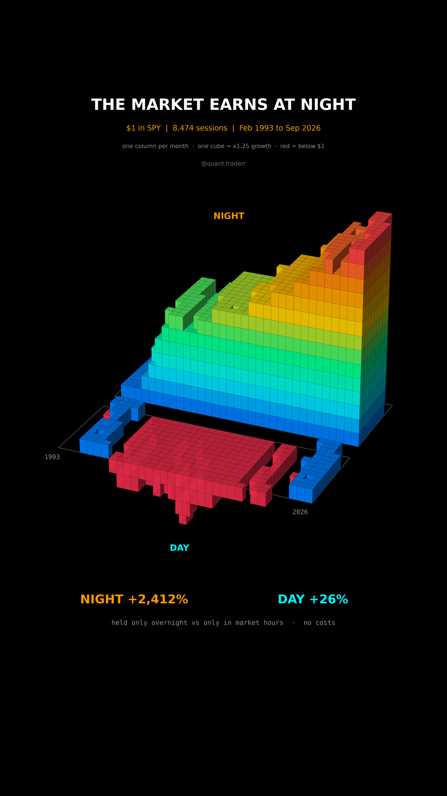

# The Market Earns at Night

SPY split into the two halves of every trading day: the gap from yesterday's
close to today's open (night) and the move from today's open to today's close
(day). One dollar held only in each half, from Feb 1993 to Sep 2026.



## What it measures

```
night_t = Open_t / Close_{t-1} - 1
day_t   = Close_t / Open_t     - 1
```

The two halves multiply back to buy-and-hold exactly, which `validate()`
asserts. Prices are Yahoo's auto-adjusted SPY, so open and close carry the
same dividend and split factor on any day and nothing leaks into one half.

In 3D: a voxel grid. One column per calendar month, years along the long axis,
months across. The back block is NIGHT, the front block is DAY. Column height
is the value of that block's dollar at the end of the month on a log scale,
one cube per factor of 1.25. Cubes below the floor mean the dollar is below 1.
Colour carries the same height.

## What came out

| Figure | Value |
|---|---|
| Sessions | 8,474 |
| A dollar held only overnight | $25.12 (+2,412%) |
| A dollar held only in market hours | $1.26 (+26%) |
| Buy and hold, both halves | +3,071% |
| Calendar years in which night beat day | 24 of 34 |

## What this is not

**Not a strategy.** In at every close and out at every open is two trades a
day, and spreads plus commissions on that eat most of the gap. The dollars
here pay nothing.

Not an explanation either: an overnight risk premium, the timing of news and
the opening auction are all candidates, and this picture shows none of them.
Heights are rounded to whole cubes, the numbers in the readout are exact. One
ETF, one country, one 33-year history.

## Run it

```bash
cd ..
uv venv .venv --python 3.12
uv pip install --python .venv/bin/python -r requirements.txt
cd the-market-earns-at-night

../.venv/bin/python Overnight_Reel_Pipeline.py --smoke
../.venv/bin/python Overnight_Reel_Pipeline.py
../.venv/bin/python Overnight_Static_Pipeline.py
../.venv/bin/python Overnight_Caption.py
```
