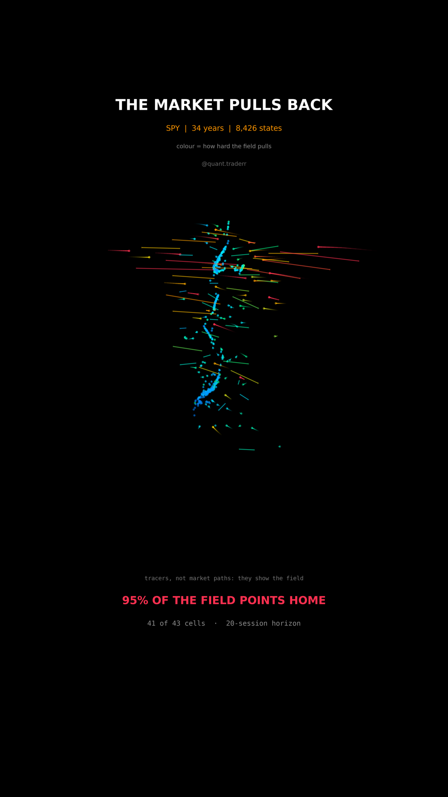

# The Market Pulls Back

Thirty four years of SPY turned into a drift field over its own state space,
with tracers released into it.



## What it measures

Three numbers place SPY on any session: 20 day momentum, 20 day realised
volatility, and drawdown from the running high. Each is standardised over the
whole sample, so one step means the same thing in every direction; without that,
the "distance" the drift measures would be dominated by whichever feature has
the widest raw spread.

The cube of state space is cut into 7 bins per axis. For every bin holding at
least 30 sessions, the arrow is the **average change of the state vector over
the following 20 sessions**. Bin edges run from the 1st to the 99th percentile,
because the tails hold a handful of sessions each and would produce arrows built
on almost nothing.

The headline share is the fraction of filled bins whose arrow has a negative
radial component: whose average next move points back toward the middle of the
distribution rather than further out.

## What came out

| Figure | Value |
|---|---|
| Filled cells (at least 30 sessions each) | 43 |
| Cells whose average next move points inward | 41 |
| Share | 95% |
| States | 8,426 |
| Horizon | 20 sessions |

## What this is not

**The particles are not market paths.** They are tracers released into an
average field and re-seeded when they reach the middle, which is how a sampled
flow is drawn. No particle is a simulation of anything that happened, and the
field between cell centres is smoothed by inverse distance weighting so the
tracers do not march in rows.

An average is not a rule. The spread around each arrow is far wider than the
arrow itself, most of it is noise, and the drift is small next to the variation
it sits in. Mean reversion in a standardised space is also **partly mechanical**,
because a standardised variable cannot run away from its own mean forever, which
is why the assert band on the inward share starts at a half rather than at zero.
Not a forecast, not a strategy, one index, overlapping windows.

## Run it

```bash
cd ..
python3 -m venv .venv
.venv/bin/pip install -r requirements.txt
cd the-market-pulls-back

../.venv/bin/python VectorField_Reel_Pipeline.py --smoke
../.venv/bin/python VectorField_Reel_Pipeline.py
../.venv/bin/python VectorField_Static_Pipeline.py
../.venv/bin/python VectorField_Caption.py
```

The tracer run is worked out once, for all 351 frames, before any frame is
drawn. That keeps a frame a pure function of its index: render frame 200 twice
and you get the same picture, which is what makes a partial re-render safe.

The first run fetches from Yahoo Finance and caches to `_cache/`. Your figures
will differ from the table above as the data moves on; the asserts are bands
rather than snapshots, so the build still passes. `figures.json` records what the
posted version was built on.
