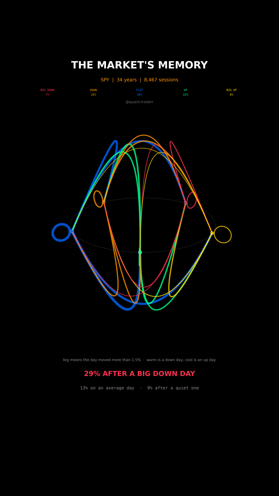

# The Market's Memory

Thirty four years of SPY reduced to five states and the transitions between
them, drawn as a chord ring and spun fast.



## What it measures

Every session goes into one of five buckets by its own return: worse than
-1.5%, -1.5% to -0.5%, the flat middle, 0.5% to 1.5%, and better than 1.5%.
The edges are set in `CONFIG`, not fitted.

Counting every pair of consecutive sessions gives the transition matrix `P`,
where `P[i][j]` is the share of days in state `i` that were followed by a day
in state `j`. Every row sums to 100% by construction, which is one of the
asserts.

The ring is those five states. A chord from `i` to `j` carries `P[i][j]` in its
width, it bows above the ring going one way round and below going the other so
direction is visible rather than implied, and a loop outside a node is that
state repeating. Colour is the state a chord leads to: warm is a down day, cool
is an up day, and brighter is a bigger day.

The headline compares three numbers out of the same matrix: the chance of a big
move after a big down day, after a flat day, and on an average day.

**This reel spins twice** rather than the quarter sweep the other reels use. A
ring is symmetric about the spin axis, so a fast rotation reads as motion
instead of the picture falling over, and no text sits inside the rotating axes:
every node label would otherwise pass through the band where Instagram puts its
buttons.

## What came out

| Figure | Value |
|---|---|
| Sessions, years | 8,467, 34 |
| Share of days in each bucket | 7%, 16%, 48%, 22%, 6% |
| Chance of a big move on an average day | 13% |
| Chance of a big move after a big down day | 29% |
| Chance of a big move after a quiet day | 9% |
| Most common transition | flat to flat, 53% |

## What this is not

Not a forecast and not a strategy. These are unconditional counts over the
whole sample, so 2008 and 2017 are mixed into one number and the clustering is
concentrated in crises rather than spread evenly.

**The bucket edges are a choice**, and every figure here moves with them. A one
day lag is the shortest possible memory: nothing in this picture says anything
about a week. And a transition matrix assumes the next day depends only on
today, which is a convenient fiction rather than a property of markets.

## Run it

```bash
cd ..
uv venv .venv --python 3.12
uv pip install --python .venv/bin/python numpy pandas matplotlib yfinance imageio-ffmpeg scipy pillow
cd the-markets-memory

../.venv/bin/python MarketMemory_Reel_Pipeline.py --smoke
../.venv/bin/python MarketMemory_Reel_Pipeline.py
../.venv/bin/python MarketMemory_Static_Pipeline.py
../.venv/bin/python MarketMemory_Caption.py
```

The first run fetches from Yahoo Finance and caches to `_cache/`. Your figures
will differ from the table above as the data moves on; the asserts are bands
rather than snapshots, so the build still passes. `figures.json` records what
the posted version was built on.
