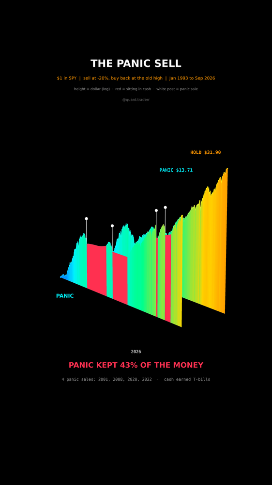

# The Panic Sell

One dollar in SPY that is never touched, against one dollar owned by a trader
who sells every time SPY closes 20% below its last high and buys back only once
the old high is reclaimed, the moment it "feels safe again". Jan 1993 to
Sep 2026, dividends reinvested, cash earns the 13-week T-bill (^IRX).



## What it measures

```
in the market:  running peak P;  close <= 0.8 * P  -> sell, go to T-bills
in cash:        close >= P                         -> buy back, reset P
```

The seller always sells at -20% or worse and buys back at the old peak, so
every round trip locks in at least the gap between those two prices.
`validate()` asserts that every buy-back sits at least 25% above its sale.

In 3D: a double wall. Time runs along the long axis, each wall rises from the
floor to its dollar on a log scale, HOLD behind, PANIC in front. Colour follows
the height; PANIC turns red for every stretch it sat in cash. A white post
marks each panic sale.

## What came out

| Figure | Value |
|---|---|
| A dollar held throughout | $31.90 |
| A dollar run by the panic rule | $13.71 |
| Share of the money the panic rule kept | 43% |
| Panic sales | 4 (2001, 2008, 2020, 2022) |
| Smallest gap between sale and buy-back | +26% |
| Years spent in cash | 11.6 |

## What this is not

Not a claim that every exit is wrong. A seller who buys back near the bottom
does fine; this rule never does. One rule, one threshold, one index over one
33-year stretch with only four bear markets, so the sample is small. No taxes
and no trading costs, both of which would make the seller look worse. The walls
are filled to the floor for readability; only their top edge is data.

## Run it

```bash
cd ..
uv venv .venv --python 3.12
uv pip install --python .venv/bin/python -r requirements.txt
cd the-panic-sell

../.venv/bin/python PanicSell_Reel_Pipeline.py --smoke
../.venv/bin/python PanicSell_Reel_Pipeline.py
../.venv/bin/python PanicSell_Static_Pipeline.py
../.venv/bin/python PanicSell_Caption.py
```
