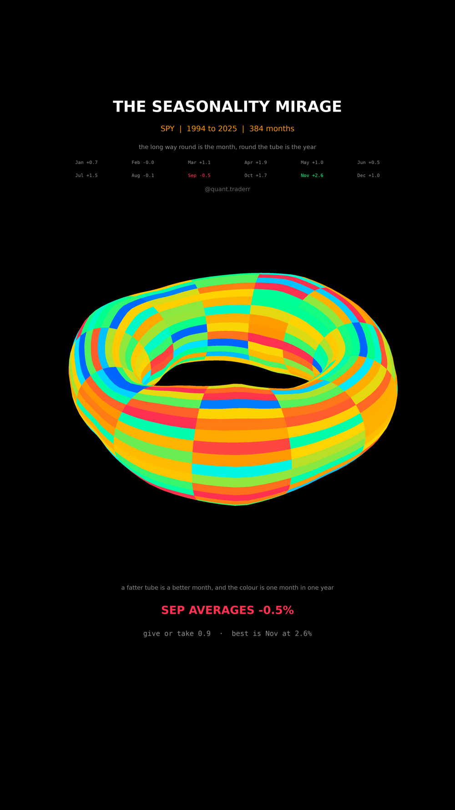

# The Seasonality Mirage

Every month of every whole year of SPY on one torus, with the error bar that
the calendar effect does not survive.



## What it measures

Monthly total returns for SPY, restricted to complete calendar years, which is
1994 to 2025 here: 32 years, 384 months. A partial year would leave a bite out
of the torus, and every figure in the reel is read off the grid that is
actually drawn.

The shape follows the data rather than decorating it. A torus has two angles
and this data has two indices:

- the long way round the ring is the **month**, January to December
- once round the tube is the **year**
- one patch is one month of one year, coloured by that month's return
- the tube is **fatter where that month's average is higher**

So the lumps are the seasonal effect, and the stripes are the spread it was
averaged from. Against each lump sits the standard error of that average,
`sd / sqrt(32)`, printed in the readout rather than left out.

One implementation note. The first version built twelve separate sectors, one
per month at its own constant radius, which left a wedge shaped hole at every
boundary; plugging those with dark walls looked worse than the holes. The tube
radius is now interpolated between the month centres and wrapped from December
back into January, so the whole thing is one seamless surface.

## What came out

| Figure | Value |
|---|---|
| Span | 1994 to 2025, 32 whole years, 384 months |
| Weakest month | September, -0.5% average |
| Standard error on that average | 0.9 |
| Strongest month | November, 2.6% average |
| Spread, best to worst | 3.1 points |

## What this is not

Not a trading calendar. **September's average is less than one standard error
from zero**, and the pipeline asserts exactly that: if the weakest month ever
moved more than two standard errors from zero, the build would fail rather
than quietly ship a reel whose own claim had stopped being true.

Twelve months are also tested at once, so the best looking month is partly the
winner of twelve draws. One index, one country, and the years are treated as
independent when they are not. Nothing here forecasts anything.

## Run it

```bash
cd ..
uv venv .venv --python 3.12
uv pip install --python .venv/bin/python numpy pandas matplotlib yfinance imageio-ffmpeg scipy pillow
cd the-seasonality-mirage

../.venv/bin/python Seasonality_Reel_Pipeline.py --smoke
../.venv/bin/python Seasonality_Reel_Pipeline.py
../.venv/bin/python Seasonality_Static_Pipeline.py
../.venv/bin/python Seasonality_Caption.py
```

The first run fetches from Yahoo Finance and caches to `_cache/`. Your figures
will differ from the table above as the data moves on; the asserts are bands
rather than snapshots, so the build still passes. `figures.json` records what
the posted version was built on.
