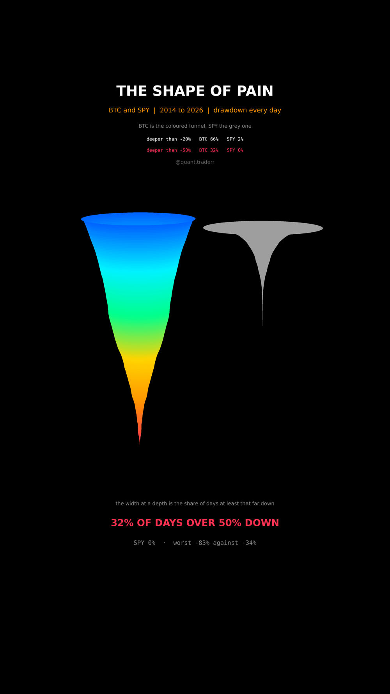

# The Shape of Pain

Bitcoin and the S&P measured in time spent underwater, drawn as two funnels on
one shared depth axis.



## What it measures

Drawdown is how far below its own running maximum a price sits, in percent, on
every day. That is one number per day per asset, and the reel asks a single
question of it:

> how much of its life does this asset spend at least this far down?

For a depth `d`, the share of days with drawdown at or below `d` is the width
of the funnel there. At the rim every day qualifies, so both funnels start at
the same radius and then narrow at their own pace. **A funnel that stays wide
is an asset that spends its life far from its highs.**

Both assets are measured over the same calendar span, the one Bitcoin has, and
each against its own running maximum. The depth to height mapping is shared by
both funnels, because scaling them separately would be a lie told with axes.

## What came out

| Figure | BTC | SPY |
|---|---|---|
| Worst drawdown | -83% | -34% |
| Share of days deeper than -20% | 66% | 2% |
| Share of days deeper than -50% | 32% | 0% |
| Share of days at a new high | 4% | 15% |
| Days in the sample | 4,388 | 3,020 |

## What this is not

**Not a return comparison, and deliberately so.** Over this same span Bitcoin
returned far more than the S&P, and none of that return is in this picture.
This is the cost side on its own, which is the half that usually goes missing
from a Bitcoin chart, not the whole story.

The two assets also do not trade on the same days: Bitcoin trades every day of
the year and the S&P about 252, so these are shares of each asset's own days
rather than of a shared calendar. A drawdown series depends on where the
sample starts, and this one starts where Bitcoin's usable history does. One
sample, one cycle era, no forecast.

## Run it

```bash
cd ..
uv venv .venv --python 3.12
uv pip install --python .venv/bin/python numpy pandas matplotlib yfinance imageio-ffmpeg scipy pillow
cd the-shape-of-pain

../.venv/bin/python Drawdown_Reel_Pipeline.py --smoke
../.venv/bin/python Drawdown_Reel_Pipeline.py
../.venv/bin/python Drawdown_Static_Pipeline.py
../.venv/bin/python Drawdown_Caption.py
```

The first run fetches from Yahoo Finance and caches to `_cache/`. Your figures
will differ from the table above as the data moves on; the asserts are bands
rather than snapshots, so the build still passes. `figures.json` records what
the posted version was built on.
