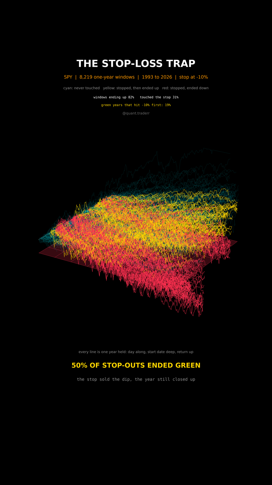

# The Stop-Loss Trap

Every one-year holding window of SPY since 1993, started on every trading day,
run through a stop-loss at -10%.



## What it measures

For each start day `s`, the path is `price(s + k) / price(s) - 1` for
`k = 0 .. 252` trading days, on adjusted closes so dividends are in. A window
**touched the stop** if its path reached -10% at any point inside the year.
For every window that touched it, the question is where it finished on day
252.

In 3D: the trading day inside the window runs along the floor, the start date
runs into depth, the return goes up. The red sheet is the stop at -10%. All
paths grow together one trading day at a time, and the counter shows how many
windows have touched the stop so far.

- cyan: never touched the stop
- yellow: touched it, then finished the year up
- red: touched it, finished the year down

## What came out

| Figure | Value |
|---|---|
| One-year windows | 8,219 |
| Windows that finished up | 82% |
| Windows that touched -10% | 31% |
| Of those, finished the year in profit | 50% |
| Median one-year result of those | +13% |
| Green years that dipped through -10% first | 19% |
| Stop-outs that finished below the stop level | 36% |

## What this is not

**Not an argument against every stop.** On the S&P the stop cut the worst
years short, 2008 above all, and on a single stock that can go to zero a stop
is a different tool entirely.

The windows overlap heavily: a window started today shares all but one day
with the one started yesterday. So these are not 8,219 independent trials,
this is one index over one stretch of history. The counterfactual also
ignores taxes, trading costs and whatever the stopped-out money did next,
and it assumes the stop fills at -10%, which on a gap down it does not. Only
every 14th window is drawn; every figure uses all of them.

## Run it

```bash
cd ..
uv venv .venv --python 3.12
uv pip install --python .venv/bin/python numpy pandas matplotlib yfinance imageio-ffmpeg scipy pillow
cd the-stop-loss-trap

../.venv/bin/python StopLoss_Reel_Pipeline.py --smoke
../.venv/bin/python StopLoss_Reel_Pipeline.py
../.venv/bin/python StopLoss_Static_Pipeline.py
../.venv/bin/python StopLoss_Caption.py
```

The first run fetches from Yahoo Finance and caches to `_cache/`. Your figures
will differ from the table above as the data moves on; the asserts are bands
rather than snapshots, so the build still passes. `figures.json` records what
the posted version was built on.
