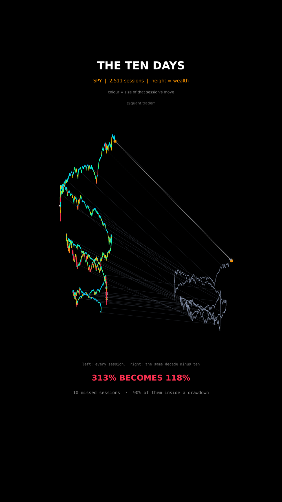

# The Ten Days

Ten years of SPY as a climbing spiral, next to the same decade with its ten best
sessions removed. Height is wealth, so the shorter tower is the argument.



## What it measures

Daily total return of SPY over ten years, dividends reinvested. The bright coil
compounds every one of the 2,511 sessions. The dim coil is the identical series
with the ten largest daily returns set to zero and every other day left exactly
where it was, so both towers see the same calendar bar those few days.

The angle is elapsed time wrapped into three turns for display and the radius
opens with time so the coil does not sit on top of itself. Neither carries
meaning beyond making the shape readable; the height does the work.

Cell colour is the size of that session's move. The rungs between the towers
link them in time, and the rungs fanning apart is the gap growing.

## What came out

| Figure | Value |
|---|---|
| Ten year growth, every session | 313% |
| Same decade, ten best sessions removed | 118% |
| Share of the gain carried by those ten days | 62% |
| Of those ten days, share inside a drawdown deeper than 10% | 90% |
| Best single session | 10.5%, Apr 2025 |

The ten sessions that carried the decade were not scattered through the calm
stretches. Nine of the ten landed while the index was more than 10% below its
previous high, which is exactly when stepping aside feels most sensible.

## What this is not

Not a strategy and not advice. **Nobody can remove only the best days.** The
mirror case, dodging the ten worst sessions, is just as extreme and is not shown
here, so this is an argument about timing being hard rather than proof that
holding always wins. One index, one decade, no costs and no tax.

## Run it

```bash
cd ..
python3 -m venv .venv
.venv/bin/pip install -r requirements.txt
cd the-ten-days

../.venv/bin/python TenDays_Reel_Pipeline.py --smoke   # 3 frames
../.venv/bin/python TenDays_Reel_Pipeline.py           # 351 frames -> topic.mp4
../.venv/bin/python TenDays_Static_Pipeline.py         # hero still
../.venv/bin/python TenDays_Caption.py                 # caption, gated
```

The first run fetches from Yahoo Finance and caches to `_cache/`. Your figures
will differ from the table above as the data moves on; the asserts are bands
rather than snapshots, so the build still passes. `figures.json` records what the
posted version was built on.
