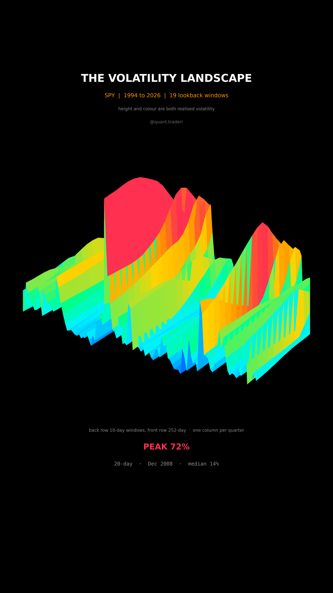

# The Volatility Landscape

Thirty four years of SPY seen through nineteen lookback windows at once, drawn
as terrain.



## What it measures

Realised volatility is not one number, it is a number per lookback window.
Nineteen windows are spaced geometrically from 10 sessions to 252, one trading
year. For each one

```
sigma_t = std(log returns over the window) * sqrt(252)
```

in percent. That is a grid of window against time. Height and colour are both
that volatility, so the ridges are the crises and the blue plain is an ordinary
market.

Two decisions carry the picture:

**One column is one quarter, and it is the average over that quarter.** The
daily grid is eight thousand columns wide, which at reel size is a comb of two
pixel fins rather than terrain, so it has to be summarised. A period end
snapshot drops whatever happened between two dates. A maximum was worse: it
turns a single bad week into an isolated one column wall that reads as a
rendering glitch. An average of an already rolling measure understates the
extremes rather than inventing them.

**Every figure is read off the grid that is drawn**, not off the daily series
behind it, so the number in the readout is a number you can find in the
picture.

One rendering detail worth keeping: the surface is drawn as one strip per row,
back to front, with `computed_zorder=False`. Matplotlib depth sorts each quad
of a surface by its centroid, so a tall wall in a back row draws over the rows
in front of it and the terrain sprouts detached slivers.

## What came out

| Figure | Value |
|---|---|
| Span | 1994 to 2026, 34 years |
| Lookback windows | 19, from 10 to 252 sessions |
| Tallest point | 72%, the 20 session window, Dec 2008 |
| Median across the whole grid | 14% |
| Worst the 252 session window ever reached | 45% |

## What this is not

Not implied volatility, so nothing here is what the options market expected.
Not a forecast: realised volatility is backward looking by construction.

The windows overlap heavily, so neighbouring rows are not independent
measurements, they are the same returns re-averaged. One index. **And the
quarterly average flattens anything that began and ended inside one quarter**,
which for a 10 session window is a lot of what makes it interesting, so the
short rows here are calmer than the daily series they come from.

## Run it

```bash
cd ..
uv venv .venv --python 3.12
uv pip install --python .venv/bin/python numpy pandas matplotlib yfinance imageio-ffmpeg scipy pillow
cd the-volatility-landscape

../.venv/bin/python VolLandscape_Reel_Pipeline.py --smoke
../.venv/bin/python VolLandscape_Reel_Pipeline.py
../.venv/bin/python VolLandscape_Static_Pipeline.py
../.venv/bin/python VolLandscape_Caption.py
```

The first run fetches from Yahoo Finance and caches to `_cache/`. Your figures
will differ from the table above as the data moves on; the asserts are bands
rather than snapshots, so the build still passes. `figures.json` records what
the posted version was built on.
