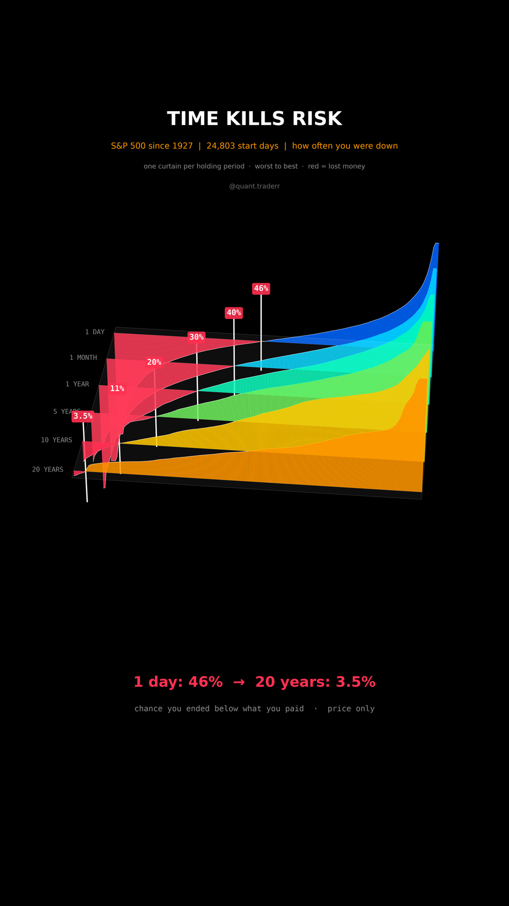

# Time Kills Risk

How often the S&P 500 was below what you paid, depending only on how long you
held. Every trading day since Dec 1927 is a start day.



## What it measures

Data: S&P 500 price index (`^GSPC`) daily closes from Yahoo. For each start
day `t` and holding period `h` of 1, 21, 252, 1260, 2520 and 5040 sessions
(1 day, 1 month, 1 year, 5, 10 and 20 years):
`r = close[t+h] / close[t] - 1`. The loss share is the fraction of start days
with `r < 0`.

In 3D: one curtain per holding period, 1 day at the back, 20 years in front.
Along each curtain the start days are sorted from worst to best outcome, and
the height is that outcome. The red part below the floor is exactly the loss
share; a white post marks where the curtain crosses zero. Each curtain is
scaled by its own 95th percentile of |r|, so heights compare shapes, not sizes.

## What came out

| Held for | Start days were down |
|---|---|
| 1 day | 46% |
| 1 month | 40% |
| 1 year | 30% |
| 5 years | 20% |
| 10 years | 11% |
| 20 years | 3.5% |

Start days with a 1-day outcome: 24,803. Every 20-year loss started between
Dec 1927 and Oct 1930; the worst, Sep 1929, was at -50% twenty years later.

## What this is not

**Not a promise that 20 years is safe.** Overlapping windows share most of
their days, so the 20-year row rests on a handful of independent periods, and
all of its losses come from one crash. This is the price index: with
dividends the long-run loss share would be lower, after inflation it would be
higher. One index, one country, a century that went well.

## Run it

```bash
cd ..
uv venv .venv --python 3.12
uv pip install --python .venv/bin/python -r requirements.txt
cd time-kills-risk

../.venv/bin/python HoldingPeriod_Reel_Pipeline.py --smoke
../.venv/bin/python HoldingPeriod_Reel_Pipeline.py
../.venv/bin/python HoldingPeriod_Static_Pipeline.py
../.venv/bin/python HoldingPeriod_Caption.py
```
