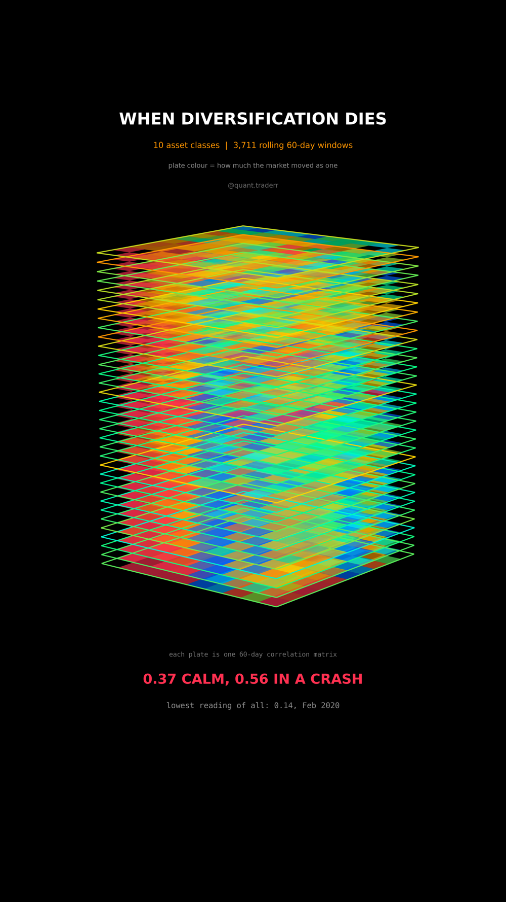

# When Diversification Dies

Fifteen years of cross asset correlation, drawn as a stack of plates. Each plate
is one 60-day correlation matrix; height is time, so the stack reads from the
bottom of the period up.



## What it measures

Ten exchange traded funds, chosen to span asset classes rather than ten flavours
of the same thing: `SPY QQQ IWM EFA EEM TLT LQD HYG GLD VNQ`. US large cap, US
small cap, developed and emerging equity, long government bonds, investment
grade credit, high yield credit, gold, real estate.

For every session, a correlation matrix of daily log returns over the trailing
60 sessions. Every 110th of those matrices is drawn as a plate. Each cell is one
pair; the diagonal is left empty, because a correlation of one with itself is
not information and a red spine up the middle of the stack would only be noise.

Cell colour is that pair's correlation. The frame around each plate carries the
plate's own mean off-diagonal correlation, which is what makes the crises
visible as warm bands: without it the stack is a rainbow and the one thing the
reel is about, the level moving with the market, disappears.

A session counts as a crisis when SPY sits more than 15% below its running high.
That is a real drawdown in the reference asset rather than a volatility
threshold, because the claim is about what happens while portfolios are actually
losing money.

## What came out

| Figure | Value |
|---|---|
| Mean pairwise correlation, calm | 0.37 |
| Mean pairwise correlation, drawdown deeper than 15% | 0.56 |
| Lowest reading in the period | 0.14, Feb 2020 |
| Highest reading in the period | 0.70, May 2026 |
| Rolling windows | 3,711 |

The lowest reading of the whole period landed a few weeks before the fastest
crash in the sample. That is one observation, not a signal, and nothing in this
code claims a low reading predicts anything.

## The gate

`validate()` asserts, among other things, that crisis correlation is **above**
calm correlation. That is not a plausibility check, it is the claim of the reel:
if a data refresh ever reverses it, the build stops rather than shipping a video
whose picture contradicts its own caption.

```python
assert d["crisis_corr"] > d["calm"], "correlation did not rise in drawdowns; the reel's claim fails"
```

`figures.json` holds what the posted version was built on.

## What this is not

Not causation and not a forecast. Ten funds are not the investable universe.
Correlation is linear dependence only and says nothing about tail behaviour,
which is precisely where a diversified portfolio actually breaks. The windows
overlap, so neighbouring plates share most of their data and consecutive
readings are not independent.

## Run it

```bash
cd ..
python3 -m venv .venv
.venv/bin/pip install -r requirements.txt
cd when-diversification-dies

../.venv/bin/python Tomography_Reel_Pipeline.py --smoke   # 3 frames
../.venv/bin/python Tomography_Reel_Pipeline.py           # 351 frames -> topic.mp4
../.venv/bin/python Tomography_Static_Pipeline.py         # hero still
../.venv/bin/python Tomography_Caption.py                 # caption, gated
```

The first run fetches from Yahoo Finance and caches to `_cache/`. Your figures
will not match the table above exactly, because the data has moved on since the
post. The asserts are bands rather than snapshots, so the build still passes.
